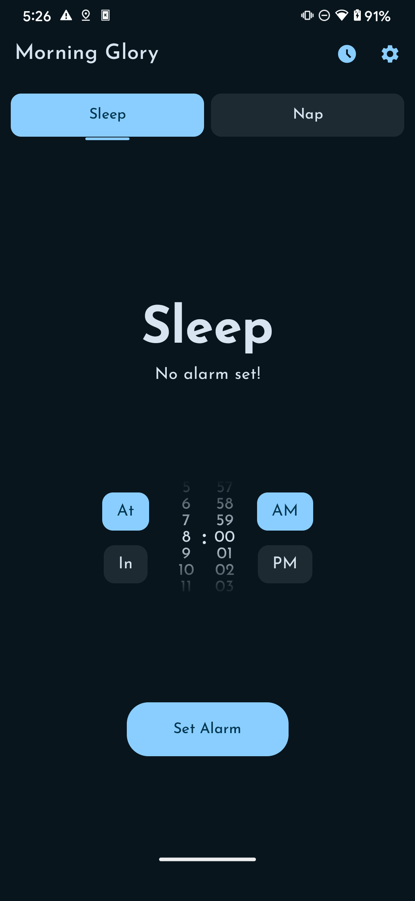
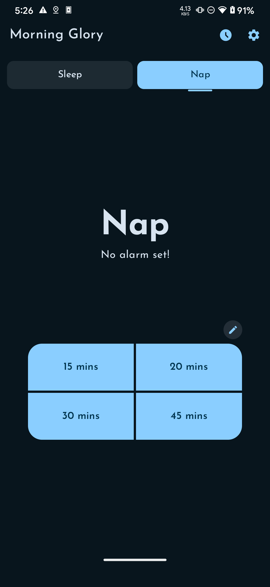
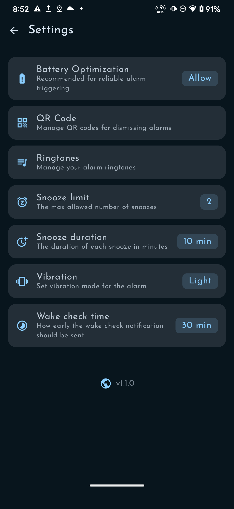
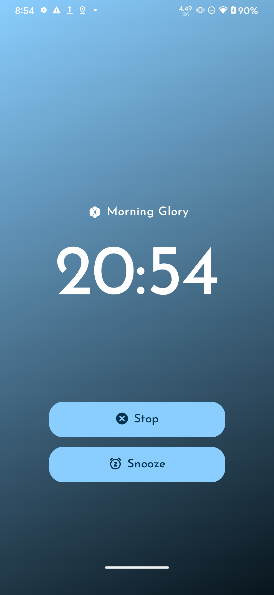

# Morning Glory

A minimalist alarm app that I made according to my own personal needs of having trouble waking up,
needing to quickly setup nap alarms and more. The features may not be your cup of tea but that's for
you to decide.

## Images

      

## Features

* **Two Dedicated Alarms:** Simplicity is key. The app features two persistent alarms:
    * **Sleep:** For your main nightly rest. Supports "At" (specific time) and "In" (duration)
      modes.
    * **Nap:** Four customizable quick-access nap durations.
    * *No new alarms can be created, promoting a focused and consistent routine.*

* **Night Clock:** A dedicated immersive bedside mode.
    * **Gesture Controls:** Vertical swipes allow you to dim or brighten the screen perfectly for
      night use.

* **Custom & Random Ringtones:** Wake up to sounds you love. Import any sound from your phone.
  Enable **Randomize Ringtones** to have a different sound picked for every alarm, keeping your
  wake-up experience fresh.

* **QR Code Lock:** For the heavy sleepers! To dismiss an alarm, you must scan a pre-selected QR
  code. Place it in another room to force yourself out of bed.

## Upcoming Features

* **Custom Alarm Screen Image:** Personalize your wake-up screen by adding your own image.
* **NFC locks:** Another way to lock the dismiss button by having to tap an NFC tag.

## Extra

I had also added this feature called 'Follow-up Notification'. A certain time after the alarm, a
notification would be sent to check whether the user is awake or not, if not dismissed, it would
setup the alarm again. It was for times a person goes back to sleep after dismissing the alarm.
Although I removed it because it gave the user a thought that the follow-up would wake them, leading
them to have less resistence in falling back to sleep.

## License

This project is licensed under the GNU GPL3. See the [LICENSE](LICENSE) file for details.
